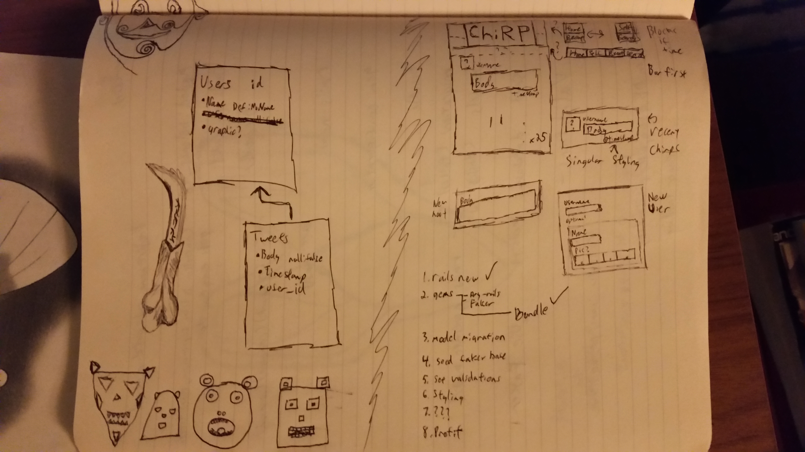

After creating your UMLs, sketches, and diagrams you will:
Ensure that field that is required should be enforced on in the database (with null: false) and in the model with validations.
Create a seed file to generate multiple users with multiple tweets.
Create a controller action for users that correspond to index and show.
The show page for any User should show all their Tweets.
Create a controller actions for tweets that correspond to index and show.
Use rails g model to generate your models and migrations more quickly.
Use rails g controller to generate your controllers more quickly.
Routes Hint: Rails Routing Guide
The tweets index page should only display 25 tweets at a time.

##Twitter Like : Chirpy (Name defunct due to rails naming conflict)

Explorer mode completion.

Simulates a basic twitter-esque setup, users and messages stored in tables being
 dynamically plopped.

Currently no functionality to add/remove/edit items from the site, populated by
 a random assortment of accounts and messages.

 UMLs and predesign work included as:
 

Site is based around getting navigational functionality into the site quickly,
  no currently known bugs passing between tweet listing pages, user pages, or
  returning to home. Additional concern is scope and planning.

Rails Generate commands were experimented with and utilized for the first time,
  including controller, model, route, database and view generation.

###USAGE

Run rails s to start server then navigate to http://localhost:3000, from there
  it should be fairly easy to navigate items.  Basic pagination is included for
  the tweets, as there can be a good number of them.

Currently the Create button is a placeholder that doesn't do anything.
